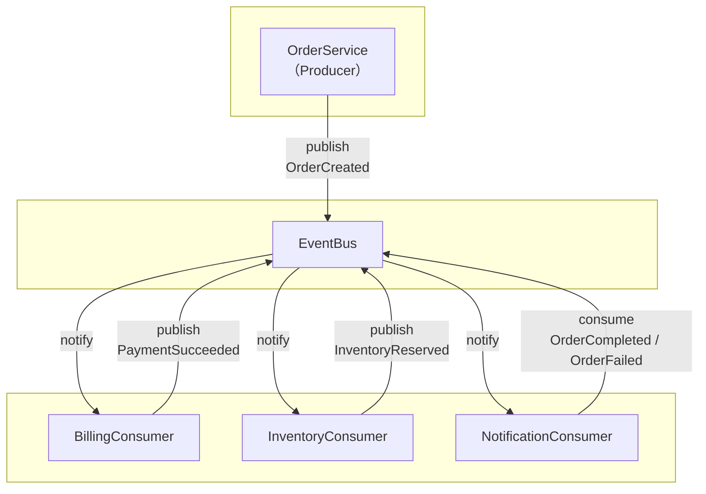

# simple-eda ─ 最小で理解するイベント駆動アーキテクチャ（EDA）

このサンプルは、Zenn 記事  
🦉 **「フクロウと学ぶアーキテクチャ #4 ─ イベント駆動アーキテクチャ（EDA / CQRS / Event Sourcing）」**  
で紹介している **イベント駆動アーキテクチャ（EDA）の最小構成** を Python で再現したものです。

---

## このサンプルの目的

- EDA の本質である **「状態ではなく変化（イベント）でつなぐ」** を体験する  
- Publish / Subscribe（発行—購読）の流れを、コードで理解する  
- Consumer が疎結合になることで、処理フローを自由に拡張できることを感じる  
- CQRS や Event Sourcing への拡張が自然に見えてくる構造を体感する  

---

## アーキテクチャ構成（図案）

（図案提案：Publisher → EventBus → Consumers の矢印関係を示す図）



- **OrderService** が OrderCreated イベントを発行  
- **EventBus** が Subscriber（購読者）に配信  
- Consumer がイベントに応じて処理し、必要に応じて別イベントを発行  
- 処理の“流れ”をイベントの連鎖で表現する設計

---

## ディレクトリ構成

```
simple-eda/
  README.md
  src/
    app.py                 # デモエントリポイント
    event_bus.py           # 最小のイベントバス（Publish / Subscribe）
    domain/
      events.py            # すべてのイベント定義
      models.py            # 在庫の簡易モデル
    producers/
      order_service.py     # 注文作成 → OrderCreated を発行
    consumers/
      billing.py           # 決済処理
      inventory.py         # 在庫確保
      notification.py      # 完了/失敗通知
```

---

## ▶ 実行方法

```
cd samples/event-driven/simple-eda/src
python app.py
```

外部ライブラリは不要。  
Python **3.10 以上**で実行可能です。

---

## 実行すると何が起きる？

EDA の「イベント連鎖」をそのまま体験できます。

1. **OrderService** が注文を作成  
2. **OrderCreated** イベントが発行  
3. BillingConsumer / InventoryConsumer が同時に反応  
4. Billing が **PaymentSucceeded** を発行  
5. 在庫があれば Inventory が **InventoryReserved** を発行  
6. オーケストレーターが **OrderCompleted** を発行  
7. NotificationConsumer が結果を通知（print）

最後に **イベントログ（EventBus.event_log）** も一覧表示されます。

---

## このサンプルで理解できる EDA の特徴

- Producer と Consumer が **完全に疎結合**  
- 機能追加が **EventBus の subscribe** だけで可能  
- 「同期 API 呼び出しの依存関係」が不要  
- **イベントが“ワークフロー”を決定する** という思想  
- Event Sourcing の導入が容易（イベント履歴をすでに保持できる）

---

このサンプルは「最小構成で EDA の本質に触れる」ことを目的としています。ぜひ自由に Consumer を追加して、イベント駆動の楽しさを体感してみてください！